# SafeMask: Road Segmentation That Knows When It Is Unsure

SafeMask is a self-driving road-segmentation project. The model labels
every pixel in a driving image (road, car, sky, etc.) and at the same
time tells you how confident it is about each label. The goal is to
flag the parts of the image where the model is probably wrong, so a
self-driving system can be careful around them. This is mostly useful
in fog, rain, snow, and night, where regular models tend to be
confidently wrong.

## Results

All result images are in the [`results/`](results/) folder.

### 1. SafeMask demos — segmentation + uncertainty on adverse weather

Four panels per image: original, predicted segmentation, normalized
uncertainty heatmap, and the red warning overlay (pixels with
uncertainty above 0.5).

**Fog** — 23.5 % of pixels flagged as uncertain
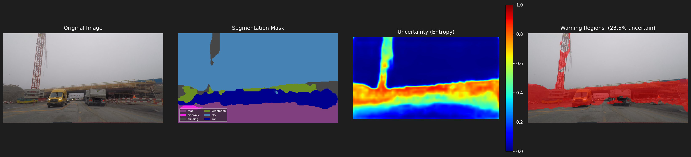

**Night** — 16.9 % uncertain
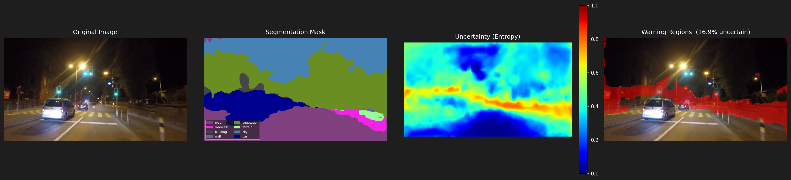

**Rain** — 19.3 % uncertain


**Snow** — 17.5 % uncertain
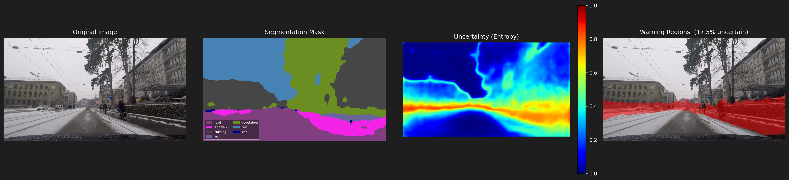

### 2. CS 136 preprocessing techniques

Each technique applied to the same fog frame from ACDC.

| Step | Output |
|---|---|
| Gaussian blur (sigma = 2) | 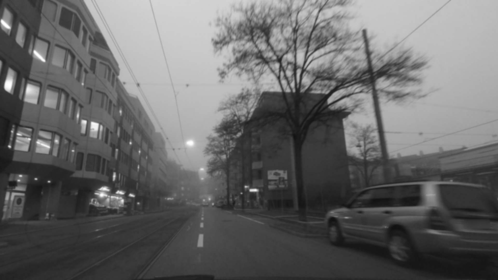 |
| Sobel edges (P75 threshold) | 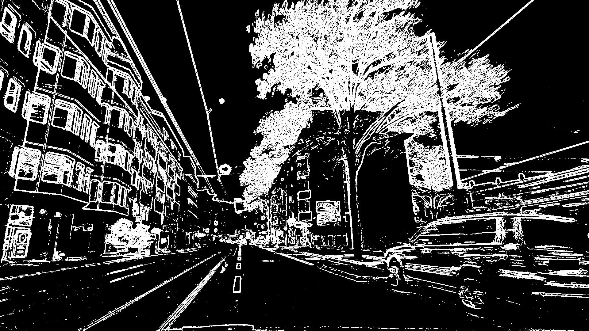 |
| Canny edges (Project 3 port) | 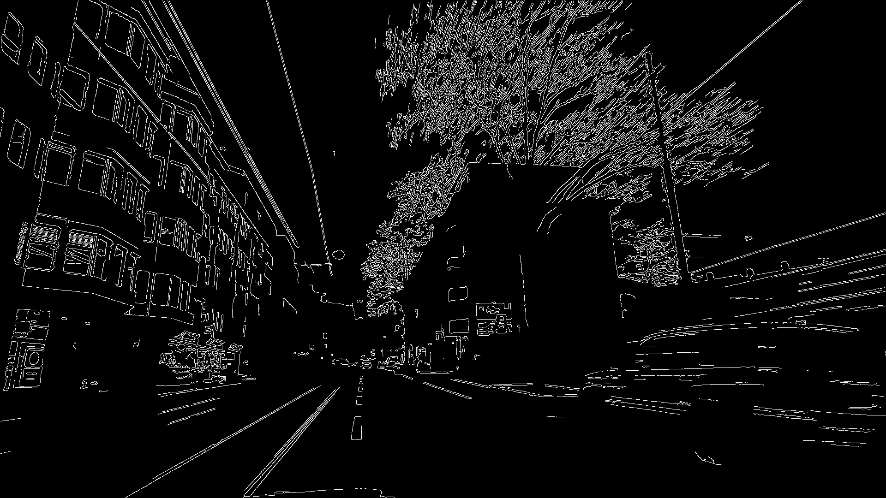 |
| Hough Transform (lane lines) | 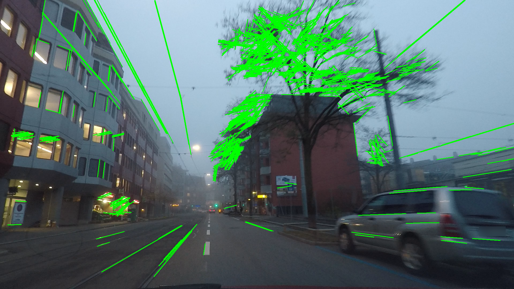 |

### 3. Creative idea — CLAHE + Bilateral + Canny

Plain Canny misses most edges in fog and night because the contrast is
too low. Our 3-step pipeline boosts local contrast with CLAHE on the L
channel, denoises with a bilateral filter (edge-preserving), then runs
Canny on the cleaned-up image.

**Fog**

| Plain Canny | CLAHE + Bilateral + Canny |
|---|---|
| 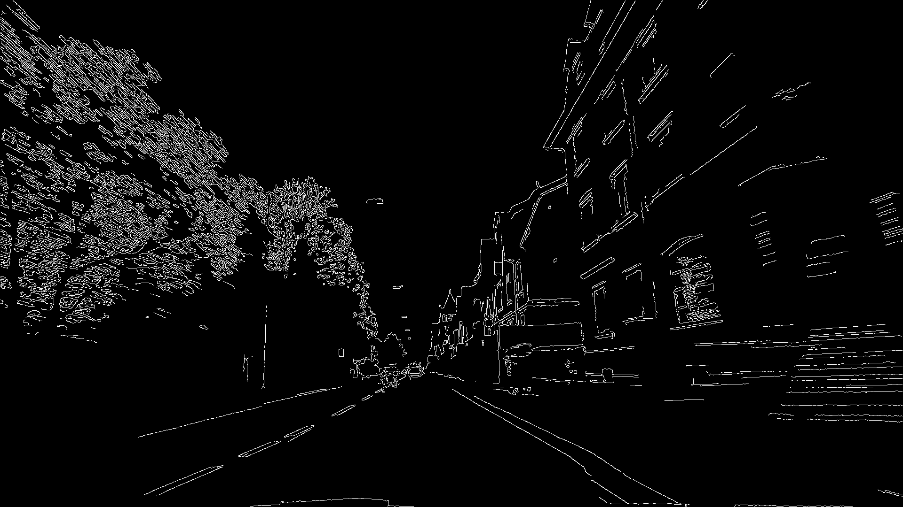 | 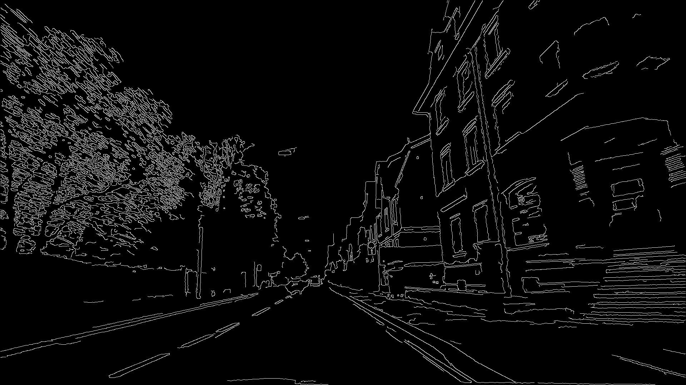 |

**Night**

| Plain Canny | CLAHE + Bilateral + Canny |
|---|---|
| 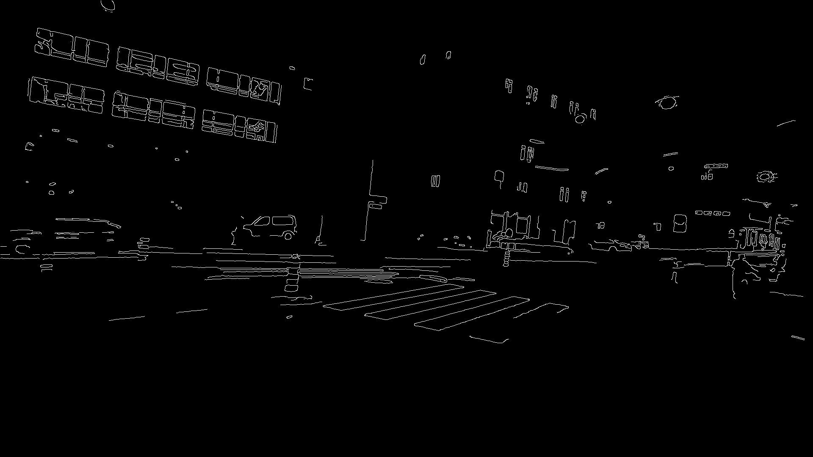 | 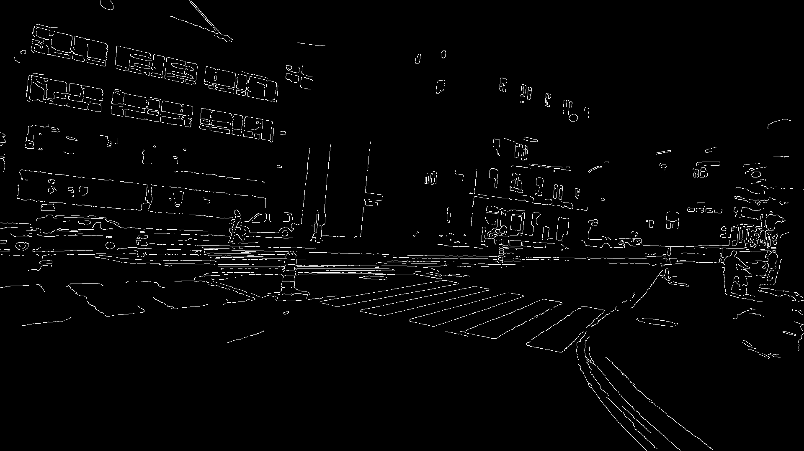 |

### 4. Robustness study

We compared three edge detectors on 80 ACDC images, with each image
distorted three ways (Gaussian noise σ=25, motion blur 15 px, low
contrast). IoU is between the clean edge map and the distorted edge
map — higher = more robust.


**Key finding:** adding a sigma=1 Gaussian pre-blur before Canny
almost doubles its noise robustness (IoU 0.18 → 0.34).

Diagnostic strip below shows the visual proof on a noisy fog frame —
**left:** clean Canny, **middle:** Canny on the noisy image (broken
edges), **right:** Canny with the sigma=1 pre-blur (most clean edges
recovered).

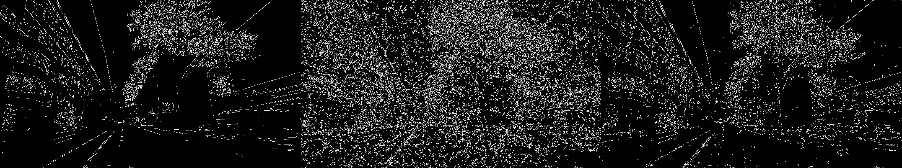

## What it does

- **Segmentation**: We use DeepLabV3+ from `segmentation_models_pytorch`
  with a ResNet backbone. This is a standard semantic segmentation
  model.
- **Uncertainty**: For every pixel we compute Shannon entropy on the
  model's output probabilities. Low entropy means the model is sure,
  high entropy means it is guessing. We normalize this to a 0..1 score.
- **Warning overlay**: We draw the high-uncertainty pixels on top of
  the predicted image as red warning regions. The threshold is
  adjustable.
- **Evaluation**: We measure mean IoU and pixel accuracy on clear vs.
  adverse weather, and we check whether the uncertainty score actually
  matches where the model gets things wrong.
- **Live demo**: A Streamlit app lets you upload an image and see the
  segmentation and uncertainty overlays in real time, with a slider
  for the threshold.

## Folders

```
SafeMask/
├── app/                  # Streamlit demo app
├── configs/              # YAML config files
├── preprocessing/        # CS 136 preprocessing scripts (Part 1, 2, 3)
├── outputs/              # Trained weights and saved visualizations
├── scripts/              # CLI scripts: train, evaluate, infer
├── src/                  # Main code
│   ├── datasets/         # PyTorch data loaders
│   ├── models/           # Model definitions
│   ├── preprocessing/    # CS 136 preprocessing wired into training
│   ├── training/         # Training loop
│   ├── uncertainty/      # Entropy and warning regions
│   ├── evaluation/       # Validation metrics
│   └── visualization/    # Plotting helpers
└── README.md
```

## Setup

```bash
git clone https://github.com/jenilkathrotia/SafeMask.git
cd SafeMask
pip install -r requirements.txt    # Python 3.8 or newer
```

## How it works

A normal segmentation model just outputs a label for each pixel. The
problem is that in bad weather the model often gives a confident wrong
answer, which is dangerous for self-driving.

SafeMask adds an uncertainty layer on top. The model still outputs
probabilities for every class. We compute the Shannon entropy of those
probabilities, `H = -sum(p * log(p))`. If the model is sure (one class
has probability close to 1), entropy is near 0. If the model is
unsure (probabilities spread across classes), entropy is high. We
normalize this to a 0..1 score, then mark anything above a threshold
as a "warning region". A self-driving system can then choose to slow
down or ask for human help in those areas.

## How to use it

### Train

Edit `configs/config.yaml` to point at your ACDC or Cityscapes images,
then run:

```bash
python scripts/train.py --config configs/config.yaml
```

To smoke-test the pipeline with no real data:

```bash
python scripts/train.py --dummy
```

### Inference on one image

```bash
python scripts/infer.py --image path/to/image.jpg --output outputs/visualizations/res.png
```

### Evaluate by weather

```bash
python scripts/evaluate.py --condition fog
```

### Live demo

```bash
streamlit run app/app.py
```

## CS 136 term project

The folder `preprocessing/` holds our CS 136 term project. It runs the
four classical techniques (Gaussian, Sobel, Canny, Hough) on the ACDC
training images, plus a creative idea (CLAHE + Bilateral + Canny) and
a robustness study that measures how each method holds up under noise,
motion blur, and low contrast. The robustness writeup lives in
`preprocessing/Part3_Robustness/REPORT.md`.

## What does not work yet, and what is next

- **Calibration**: Shannon entropy is a good baseline, but if the
  model is poorly calibrated it can still be confidently wrong on
  out-of-distribution images. We are aware of this.
- **Next**: We want to try Monte Carlo Dropout (running the model
  several times with dropout enabled and averaging) for a stronger
  uncertainty signal. We also want to check whether uncertainty stays
  consistent across short video clips, since a single noisy frame
  should not flip the prediction.
